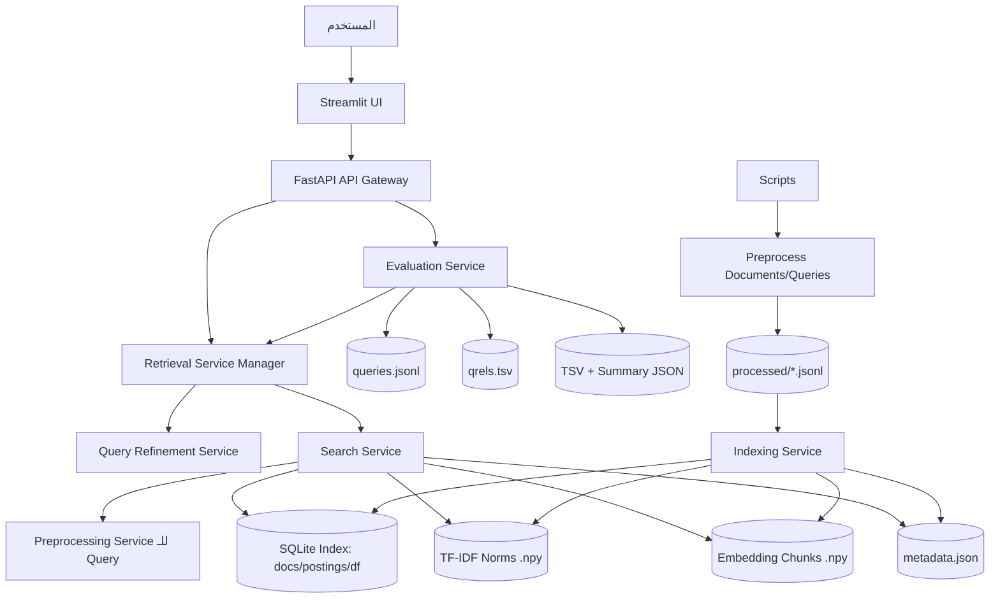

# تقرير نظام استرجاع المعلومات

**اسم المشروع:** بناء نظام استرجاع معلومات Search / Retrieval System  
**لغة التنفيذ:** Python  
**نمط البنية:** Service Oriented Architecture - SOA  
**الواجهات المستخدمة:** FastAPI كواجهة API و Streamlit كواجهة مستخدم  
**مجموعات البيانات:** `argsme_touche2022` و `clinicaltrials_2021`

---

## 1. الملخص التنفيذي

يهدف هذا المشروع إلى بناء محرك بحث مخصص قادر على استرجاع الوثائق الأكثر صلة باستعلام المستخدم من مجموعتي بيانات مختلفتين. يعتمد النظام على مفاهيم استرجاع المعلومات التقليدية والدلالية، حيث يدعم البحث باستخدام TF-IDF و BM25 و Embeddings، إضافة إلى نمطين من البحث الهجين: البحث الهجين التسلسلي Hybrid Serial والبحث الهجين المتوازي Hybrid Parallel.

تم تصميم النظام وفق مفهوم Service Oriented Architecture بحيث يتم تقسيم المسؤوليات إلى خدمات مستقلة نسبياً: خدمة المعالجة المسبقة، خدمة الفهرسة، خدمة البحث والاسترجاع، خدمة تحسين الاستعلام، خدمة التقييم، واجهة API، وواجهة المستخدم. يساعد هذا التقسيم في جعل النظام أكثر قابلية للصيانة والتطوير والاختبار، كما يسهّل إضافة نماذج بحث جديدة أو ميزات إضافية لاحقاً دون التأثير الكبير على بقية الأجزاء.

---

## 2. نطاق المشروع والمتطلبات الأساسية

يغطي المشروع المتطلبات التالية:

1. استخدام مجموعتي بيانات تحتوي كل واحدة منهما على ملفات وثائق واستعلامات وملف أحكام ملاءمة `qrels`.
2. تنفيذ معالجة مسبقة للنصوص تشمل التطبيع، تنظيف النص، إزالة الكلمات الشائعة، واستخدام Lemmatization.
3. تمثيل الوثائق والاستعلامات بعدة طرق:
   - TF-IDF Vector Space Model.
   - BM25.
   - Dense Embeddings باستخدام نموذج SentenceTransformer.
   - Hybrid Serial.
   - Hybrid Parallel.
4. بناء فهارس على القرص لتسريع البحث وتقليل استهلاك الذاكرة.
5. معالجة الاستعلام بنفس منطق معالجة الوثائق لضمان توافق التمثيل.
6. دعم Query Refinement عبر:
   - التصحيح الإملائي.
   - توسيع المرادفات.
   - الاستفادة من سجل البحث.
7. تقييم النتائج باستخدام مقاييس IR القياسية:
   - MAP.
   - Recall.
   - Precision@10.
   - nDCG.
8. توفير واجهة API وواجهة مستخدم تسمح باختيار Dataset ونمط البحث وتعديل بعض المعاملات.

---

## 3. توصيف مجموعات البيانات المستخدمة

### 3.1 Dataset الأولى: `argsme_touche2022`

تم استخدام مجموعة بيانات `argsme_touche2022` كمجموعة مخصصة لاسترجاع النصوص الحجاجية أو النصوص ذات الطبيعة الجدلية. تحتوي هذه المجموعة ضمن المشروع على الملفات التالية:

- `docs.jsonl`: الوثائق الأصلية التي يتم البحث ضمنها.
- `queries.jsonl`: الاستعلامات الاختبارية المستخدمة في التقييم.
- `qrels.tsv`: أحكام الملاءمة التي تربط كل استعلام بالوثائق ذات الصلة.

أهمية هذه المجموعة أنها تختبر قدرة النظام على التعامل مع نصوص طبيعية ذات مضمون جدلي، حيث قد لا يكون التطابق الحرفي كافياً دائماً، لذلك تفيد نماذج Embedding والنماذج الهجينة في التقاط التقارب الدلالي بين الاستعلام والوثائق.

### 3.2 Dataset الثانية: `clinicaltrials_2021`

تم استخدام مجموعة بيانات `clinicaltrials_2021` كمجموعة ذات طبيعة طبية/بحثية متعلقة بالتجارب السريرية. تحتوي هذه المجموعة أيضاً على:

- `docs.jsonl`: وثائق التجارب السريرية.
- `queries.jsonl`: الاستعلامات.
- `qrels.tsv`: أحكام الملاءمة.

تختلف هذه المجموعة عن الأولى من حيث المجال والمصطلحات، فهي تعتمد على مفردات طبية وتفاصيل مثل الحالة المرضية، شروط الأهلية، والوصف. لذلك تفيد هذه المجموعة في اختبار قابلية النظام للتعميم على مجال متخصص، وتوضيح الفرق بين البحث اللفظي التقليدي والبحث الدلالي.

### 3.3 سبب اختيار مجموعتين مختلفتين

اختيار مجموعتين مختلفتين يسمح بتقييم النظام في سياقين مختلفين:

| Dataset | طبيعة النصوص | التحدي الأساسي |
|---|---|---|
| `argsme_touche2022` | نصوص حجاجية وجدلية | فهم العلاقة الدلالية بين الطرح والاستعلام |
| `clinicaltrials_2021` | نصوص طبية وتجارب سريرية | التعامل مع مصطلحات متخصصة وطويلة نسبياً |

هذا التنوع يساعد في معرفة أي نماذج البحث أفضل في كل مجال، وهل النماذج الهجينة تقدم تحسناً ثابتاً أم أن فعاليتها تختلف حسب طبيعة البيانات.

---

## 4. بنية المشروع البرمجية

البنية المختصرة للمشروع:

```text
.
├── api
│   ├── main.py
│   ├── retrieval_manager.py
│   └── schemas.py
├── data
│   ├── argsme_touche2022
│   │   ├── docs.jsonl
│   │   ├── queries.jsonl
│   │   └── qrels.tsv
│   └── clinicaltrials_2021
│       ├── docs.jsonl
│       ├── queries.jsonl
│       └── qrels.tsv
├── processed
│   ├── argsme_touche2022
│   └── clinicaltrials_2021
├── indexes
│   ├── argsme_touche2022
│   └── clinicaltrials_2021
├── evaluations
├── scripts
│   ├── preprocess_datasets.py
│   ├── preprocess_queries.py
│   ├── build_disk_indexes.py
│   └── search_disk_demo.py
├── services
│   ├── preprocessing_service.py
│   ├── indexing_service.py
│   ├── search_service.py
│   ├── query_refinement_service.py
│   ├── evaluation_service.py
│   └── disk_index_models.py
└── ui
    ├── app.py
    └── evaluation_charts.py
```

تعكس هذه البنية فصل المسؤوليات بين الطبقات والخدمات. فمجلد `services` يحتوي منطق العمل الأساسي، ومجلد `api` يحتوي واجهة REST، ومجلد `ui` يحتوي واجهة المستخدم، أما `scripts` فيحتوي أوامر التشغيل الخاصة بالمعالجة والفهرسة والبحث التجريبي.

---

## 5. توصيف بنية النظام وفق SOA

تم تصميم النظام وفق مفهوم Service Oriented Architecture، أي تقسيم النظام إلى خدمات مستقلة من حيث المسؤولية. لا يعني ذلك بالضرورة أن كل خدمة تعمل كعملية مستقلة أو Microservice منفصل، وإنما أن كل خدمة لها واجهة ومسؤولية واضحة ويمكن اختبارها وتشغيلها أو تطويرها بمعزل عن غيرها قدر الإمكان.

### 5.1 الخدمات الرئيسية

| الخدمة | الملف المسؤول | الدور |
|---|---|---|
| Preprocessing Service | `services/preprocessing_service.py` | تنظيف النصوص وتجهيزها للبحث اللفظي والدلالي |
| Indexing Service | `services/indexing_service.py` | بناء الفهارس على القرص: SQLite + TF-IDF norms + Embedding chunks |
| Search Service | `services/search_service.py` | تنفيذ أنماط البحث المختلفة وترتيب النتائج |
| Query Refinement Service | `services/query_refinement_service.py` | تحسين الاستعلام عبر التصحيح والمرادفات وسجل البحث |
| Evaluation Service | `services/evaluation_service.py` | تقييم جودة النتائج باستخدام qrels ومقاييس IR |
| API Gateway | `api/main.py` | استقبال طلبات البحث والتقييم وربط الواجهة بالخدمات |
| Retrieval Manager | `api/retrieval_manager.py` | إدارة خدمات البحث وتحميلها حسب Dataset |
| UI Service | `ui/app.py` | واجهة Streamlit لاختيار Dataset و Mode وتشغيل البحث والتقييم |

---

## 6. مخطط System Architecture



### 6.1 آلية التواصل بين الخدمات

- تتواصل واجهة Streamlit مع FastAPI عبر REST API.
- تستقبل FastAPI طلبات البحث والتقييم ثم تحولها إلى `RetrievalServiceManager` أو `EvaluationService`.
- يقوم `RetrievalServiceManager` بتحميل خدمة البحث المناسبة حسب Dataset وإعادة استخدامها بدلاً من تحميل النموذج والفهرس مع كل طلب.
- تعتمد خدمة البحث على ملفات الفهرسة المخزنة على القرص: SQLite، ملفات NumPy، وملفات metadata.
- تستخدم خدمة التقييم نفس مسار البحث لضمان أن النتائج التي يتم تقييمها هي نفسها نتائج النظام الفعلية.

---

## 7. خطوات تنفيذ المشروع

### 7.1 تحميل وتجهيز البيانات

تم تنظيم البيانات داخل مجلد `data` بحيث تمتلك كل Dataset مجلداً مستقلاً يحتوي على الوثائق والاستعلامات وملف qrels. بعد ذلك يتم تشغيل سكربتات المعالجة المسبقة لإنتاج ملفات داخل مجلد `processed`.

أوامر التشغيل:

```bash
python scripts/preprocess_datasets.py --dataset argsme_touche2022
python scripts/preprocess_queries.py --dataset argsme_touche2022

python scripts/preprocess_datasets.py --dataset clinicaltrials_2021
python scripts/preprocess_queries.py --dataset clinicaltrials_2021
```

### 7.2 المعالجة المسبقة Preprocessing

تقوم خدمة `PreprocessingService` بتنفيذ مرحلتين من المعالجة:

#### أ. معالجة Lexical للبحث النصي

تُستخدم مع TF-IDF و BM25 وتشمل:

- Unicode normalization.
- إزالة الروابط والبريد الإلكتروني.
- توحيد المسافات.
- تحويل الأحرف إلى lowercase.
- إزالة علامات الترقيم والمسافات.
- إزالة Stopwords مع الحفاظ على كلمات النفي مثل `not`, `no`, `never` لأنها مهمة في معنى الاستعلام.
- Lemmatization باستخدام spaCy.

الناتج الأساسي لهذه المرحلة هو:

```json
{
  "doc_id": "...",
  "raw_text": "...",
  "lexical_tokens": ["..."],
  "lexical_text": "...",
  "embedding_text": "..."
}
```

#### ب. معالجة خفيفة للـ Embeddings

تُستخدم مع نماذج SentenceTransformer، ولا يتم فيها حذف بنية النص بشكل قوي، لأن نماذج التضمين تحتاج إلى سياق لغوي أكبر. لذلك يتم الاكتفاء بالتطبيع والتنظيف الخفيف.

---

## 8. خدمة الفهرسة Indexing Service

تقوم خدمة `IndexingService` ببناء فهرس مناسب للبحث مع مراعاة عدم تحميل كل البيانات دفعة واحدة إلى الذاكرة. لذلك تم اعتماد تصميم Disk-Based / Chunked Index.

### 8.1 مخرجات الفهرسة

لكل Dataset يتم إنشاء مجلد داخل `indexes` يحتوي على:

| الملف | الوصف |
|---|---|
| `index.sqlite3` | قاعدة SQLite تحتوي الوثائق، postings، و document frequencies |
| `embedding_chunks/*.npy` | ملفات NumPy مجزأة تحتوي تمثيلات الوثائق الدلالية |
| `embedding_chunks.json` | Manifest يحدد مكان كل chunk ونطاق الوثائق داخله |
| `tfidf_doc_norms.float32.npy` | أطوال متجهات TF-IDF للوثائق لاستخدامها في Cosine Similarity |
| `metadata.json` | معلومات عامة مثل عدد الوثائق، متوسط طول الوثيقة، نموذج embedding، ومعاملات BM25 |

### 8.2 سبب استخدام SQLite وملفات NumPy

تم اختيار SQLite لأنها مناسبة لتخزين الفهرس المعكوس `Inverted Index` بشكل بسيط وقابل للاستعلام السريع دون الحاجة إلى قاعدة بيانات خارجية. أما ملفات NumPy فقد استخدمت لتخزين Embeddings على شكل chunks بهدف تقليل استهلاك الذاكرة أثناء البحث، حيث يمكن قراءة كل chunk على حدة باستخدام memory mapping.

---

## 9. خدمة البحث والاسترجاع Search Service

تعد خدمة `SearchService` قلب النظام، فهي تستقبل الاستعلام بعد تحسينه أو كما أدخله المستخدم، ثم تطبق عليه نفس معالجة الوثائق، وبعدها تنفذ نمط البحث المطلوب.

### 9.1 TF-IDF

في هذا النمط يتم تمثيل الاستعلام والوثائق كمتجهات TF-IDF. يتم حساب درجة التشابه باستخدام Cosine Similarity بين متجه الاستعلام ومتجه كل وثيقة تحتوي على مصطلحات الاستعلام.

يمتاز هذا النمط بأنه بسيط وفعال وسريع، لكنه يعتمد على التطابق اللفظي ولا يفهم المرادفات أو العلاقات الدلالية العميقة.

### 9.2 BM25

BM25 هو نموذج احتمالي لترتيب الوثائق، ويعطي وزناً للتكرار داخل الوثيقة مع مراعاة طول الوثيقة ومتوسط أطوال الوثائق. يدعم النظام تعديل معاملات BM25:

- `k1`: يتحكم بتأثير تكرار المصطلح داخل الوثيقة.
- `b`: يتحكم بمدى تطبيع طول الوثيقة.

القيم الافتراضية المستخدمة:

```text
k1 = 1.5
b  = 0.75
```

يمكن تعديل هذه القيم من الواجهة أو من API أثناء البحث أو التقييم.

### 9.3 Embedding Search

يستخدم النظام نموذج:

```text
sentence-transformers/all-MiniLM-L6-v2
```

يتم تحويل الاستعلام إلى embedding ثم مقارنته مع Embeddings الوثائق المخزنة على القرص. بما أن Embeddings تم تطبيعها، فإن الضرب الداخلي بين المتجهات يعطي نتيجة قريبة من Cosine Similarity.

يمتاز هذا النمط بقدرته على التقاط التقارب الدلالي حتى عندما لا تتطابق الكلمات حرفياً، لكنه قد يكون أبطأ من البحث اللفظي ويحتاج إلى حسابات عددية أكبر.

### 9.4 Hybrid Serial

في البحث الهجين التسلسلي يتم تنفيذ البحث على مرحلتين:

1. استخدام BM25 لجلب قائمة أولية من المرشحين بحجم `serial_candidate_k`.
2. إعادة ترتيب هذه المرشحات باستخدام Embeddings.

بعد ذلك يتم تطبيع درجات BM25 و Embedding ودمجها وفق الأوزان:

```text
final_score = serial_bm25_weight * normalized_bm25
            + serial_embedding_weight * normalized_embedding
```

هذا النمط يجمع بين سرعة BM25 وقدرة Embeddings على إعادة الترتيب دلالياً.

### 9.5 Hybrid Parallel

في البحث الهجين المتوازي يتم تشغيل أكثر من نموذج بحث بشكل مستقل:

- TF-IDF.
- BM25.
- Embedding.

ثم يتم أخذ اتحاد الوثائق المسترجعة من النماذج الثلاثة، وتطبيع درجات كل نموذج، ثم دمجها وفق الأوزان:

```text
final_score = tfidf_weight * normalized_tfidf
            + bm25_weight * normalized_bm25
            + embedding_weight * normalized_embedding
```

القيم الافتراضية:

```text
tfidf_weight     = 0.30
bm25_weight      = 0.35
embedding_weight = 0.35
```

يجب أن يكون مجموع الأوزان مساوياً لـ `1.00`، ويتم التحقق من ذلك في طبقة schemas.

---

## 10. خدمة تحسين الاستعلام Query Refinement Service

تهدف هذه الخدمة إلى تحسين صياغة الاستعلام قبل البحث، وتدعم ثلاث ميزات رئيسية.

### 10.1 التصحيح الإملائي

يتم تحليل كلمات الاستعلام ومحاولة تصحيح الكلمات الخاطئة باستخدام SpellChecker. عند وجود تصحيح، يتم تسجيل التغيير داخل refinement log حتى يتمكن المستخدم من معرفة ما الذي تغير.

مثال:

```text
climete change policy → climate change policy
```

### 10.2 توسيع المرادفات

يتم استخدام WordNet لإضافة مرادفات محدودة لبعض الكلمات المهمة في الاستعلام. الهدف هو زيادة فرصة الوصول إلى وثائق لا تستخدم نفس الكلمة حرفياً ولكنها تستخدم معنى قريباً.

### 10.3 الاستفادة من سجل البحث

يقوم النظام بحفظ الاستعلامات السابقة وأعلى الوثائق المسترجعة في ملف مثل:

```text
data/search_history_argsme_touche2022.json
```

عند تفعيل هذه الميزة، يمكن للنظام تحليل تكرارات المصطلحات في سجل البحث وإعادة تثقيل بعض الكلمات ضمن الاستعلام. عملياً، هذه الميزة تستخدم كنوع مبسط من Personalization أو Query Formulation Assistance.

---

## 11. خدمة التقييم Evaluation Service

تقوم خدمة التقييم بقراءة:

- الاستعلامات من `queries.jsonl`.
- أحكام الملاءمة من `qrels.tsv`.
- نتائج البحث من `SearchService`.

ثم تحسب المقاييس التالية لكل نمط بحث:

| المقياس | الوصف |
|---|---|
| MAP | متوسط Average Precision عبر جميع الاستعلامات |
| Recall | نسبة الوثائق الملائمة التي تم استرجاعها |
| Precision@10 | نسبة الوثائق الملائمة ضمن أول 10 نتائج |
| nDCG | مقياس يأخذ ترتيب النتائج ودرجة الملاءمة بعين الاعتبار |

### 11.1 ملفات ناتج التقييم

يتم حفظ نتائج التقييم داخل مجلد:

```text
evaluations/<dataset>/
```

ويتم إنتاج ملفين لكل نمط بحث:

- ملف `.tsv` يحتوي نتائج كل Query على حدة.
- ملف `.summary.json` يحتوي ملخص المقاييس العامة.

مثال:

```text
20260625T150245Z_bm25.tsv
20260625T150245Z_bm25.summary.json
```

### 11.2 التقييم قبل وبعد الميزات الإضافية

يدعم النظام تفعيل أو تعطيل ميزات Query Refinement أثناء التقييم، مما يسمح بإجراء مقارنة بين:

- النتائج بدون تحسينات.
- النتائج بعد تفعيل التصحيح الإملائي.
- النتائج بعد تفعيل توسيع المرادفات.
- النتائج بعد تفعيل سجل البحث.
- النتائج بعد تفعيل أكثر من ميزة معاً.

---

## 12. واجهة API

تم بناء API باستخدام FastAPI. أهم المسارات:

| المسار | النوع | الوظيفة |
|---|---|---|
| `/api/v1/health` | GET | فحص حالة النظام |
| `/api/v1/datasets` | GET | عرض حالة مجموعات البيانات والفهارس |
| `/api/v1/modes` | GET | عرض أنماط البحث المدعومة |
| `/api/v1/search` | POST | تنفيذ عملية بحث |
| `/api/v1/evaluations` | POST | تشغيل تقييم جديد |
| `/api/v1/evaluations` | GET | عرض سجلات التقييم السابقة |

مثال طلب بحث:

```json
{
  "dataset": "argsme_touche2022",
  "query": "climate change policy",
  "mode": "hybrid_parallel",
  "top_k": 10,
  "weights": {
    "tfidf": 0.30,
    "bm25": 0.35,
    "embedding": 0.35
  },
  "enable_spelling_correction": true,
  "enable_synonym_expansion": false,
  "enable_search_history": false
}
```

---

## 13. واجهة المستخدم UI

تم تنفيذ واجهة المستخدم باستخدام Streamlit. توفر الواجهة:

1. اختيار Dataset.
2. كتابة الاستعلام.
3. اختيار نمط البحث.
4. تعديل `top_k`.
5. تعديل معاملات BM25 عند الحاجة.
6. تعديل أوزان Hybrid Serial و Hybrid Parallel.
7. تفعيل أو تعطيل ميزات Query Refinement.
8. عرض النتائج وجدول الدرجات.
9. تشغيل التقييم من الواجهة.
10. عرض سجل التقييمات.
11. عرض مخططات تقارن المقاييس بين نماذج البحث.

---

## 14. تبرير القرارات التقنية

### 14.1 لماذا تم استخدام SOA؟

لأن المشروع يحتوي على مراحل مختلفة: معالجة، فهرسة، بحث، تحسين، تقييم، وواجهة. دمج كل هذه المراحل في ملف واحد سيجعل النظام صعب التطوير والصيانة. لذلك تم فصل كل مسؤولية داخل خدمة مستقلة نسبياً.

فوائد هذا التصميم:

- سهولة اختبار كل خدمة وحدها.
- إمكانية تغيير نموذج Embedding دون تعديل الواجهة.
- إمكانية إضافة Dataset جديدة بإعادة استخدام نفس الخدمات.
- إمكانية تحسين Query Refinement دون تعديل Search Service.
- قابلية أعلى للصيانة والتوسع.

### 14.2 لماذا تم استخدام Disk-Based Indexing؟

لأن مجموعات البيانات كبيرة، وتحميل كل الوثائق والـ embeddings في الذاكرة قد يسبب استهلاكاً عالياً للـ RAM. لذلك تم تخزين الفهارس والتمثيلات على القرص، وقراءة الأجزاء المطلوبة أثناء البحث.

### 14.3 لماذا تم استخدام نماذج هجينة؟

النماذج اللفظية مثل TF-IDF و BM25 قوية عندما تكون كلمات الاستعلام موجودة حرفياً في الوثيقة. أما Embeddings فهي أفضل في التقارب الدلالي. النماذج الهجينة تحاول الجمع بين ميزات الطريقتين.

---

## 15. تشغيل النظام

### 15.1 تثبيت المتطلبات

```bash
pip install -r requirements.txt
python -m spacy download en_core_web_sm
python setup_nltk.py
```

### 15.2 تجهيز البيانات

```bash
python scripts/preprocess_datasets.py --dataset argsme_touche2022
python scripts/preprocess_queries.py --dataset argsme_touche2022

python scripts/preprocess_datasets.py --dataset clinicaltrials_2021
python scripts/preprocess_queries.py --dataset clinicaltrials_2021
```

### 15.3 بناء الفهارس

```bash
python scripts/build_disk_indexes.py --dataset all
```

أو لبناء Dataset واحدة:

```bash
python scripts/build_disk_indexes.py --dataset argsme_touche2022
```

### 15.4 تشغيل API

```bash
uvicorn api.main:app --reload
```

### 15.5 تشغيل الواجهة

```bash
streamlit run ui/app.py
```

---

## 16. مقارنة أنماط البحث

| النمط | نقاط القوة | نقاط الضعف | متى يكون مناسباً؟ |
|---|---|---|---|
| TF-IDF | بسيط وسريع | ضعيف دلالياً | عند وجود تطابق لفظي واضح |
| BM25 | قوي في البحث اللفظي ويوازن طول الوثيقة | لا يفهم المرادفات بعمق | كخط أساس قوي لمعظم الاستعلامات |
| Embedding | يفهم التقارب الدلالي | أبطأ وقد يعطي نتائج عامة أحياناً | عندما تختلف صياغة الاستعلام عن الوثائق |
| Hybrid Serial | سريع نسبياً ويعيد ترتيب مرشحات BM25 دلالياً | يعتمد على جودة المرشحات الأولى | عند الحاجة لتوازن جيد بين السرعة والجودة |
| Hybrid Parallel | يجمع نتائج عدة نماذج | يحتاج ضبط أوزان | عند الرغبة بأعلى تغطية ممكنة |

---

## 17. جدول نتائج التقييم

> يتم تعبئة هذا الجدول بعد تشغيل التقييم النهائي من واجهة النظام أو من API.

| Dataset | Mode | MAP | Recall | Precision@10 | nDCG | Configuration / Notes |
|---|---:|---:|---:|---:|---:|---|
| argsme_touche2022 | TF-IDF | 0.0669 | 0.1862 | 0.2380 | 0.2124 | بدون تحسينات Query Refinement |
| argsme_touche2022 | BM25 | 0.2804 | 0.4172 | 0.8340 | 0.7997 | Tuned BM25: k1=2.4, b=0.5 |
| argsme_touche2022 | Embedding | 0.1402 | 0.2868 | 0.4560 | 0.4275 | SentenceTransformer Embedding |
| argsme_touche2022 | Hybrid Serial | 0.2810 | 0.4172 | 0.8340 | 0.8009 | BM25→Embedding rerank, candidate_k=100, BM25=0.95, Embedding=0.05, k1=2.4, b=0.5 |
| argsme_touche2022 | Hybrid Parallel | 0.2810 | 0.4172 | 0.8160 | 0.7878 | Parallel fusion, TF-IDF=0.00, BM25=0.95, Embedding=0.05, fusion_pool_k=100, k1=2.4, b=0.5 |
---


## 18. رحلة التقييم وضبط المعاملات Evaluation Journey

لم يتم اعتماد الإعدادات النهائية للنظام بشكل عشوائي، وإنما تم الوصول إليها عبر سلسلة من التجارب العملية المتدرجة. كان الهدف من هذه الرحلة هو فهم سلوك كل نموذج، ثم تحسين النموذج الأقوى، وبعدها اختبار ما إذا كانت النماذج الهجينة وميزات تحسين الاستعلام قادرة على تقديم تحسن فعلي.

تم تنفيذ رحلة الضبط الأساسية على Dataset `argsme_touche2022` لأنها كانت المجموعة التي أظهرت فروقاً واضحة بين نماذج البحث، ثم تم اعتماد أفضل إعدادات ناتجة عنها في جدول التقييم النهائي.

### 18.1 المرحلة الأولى: تشغيل جميع النماذج كخط أساس Baseline

في البداية تم تشغيل جميع أنماط البحث بدون Query Refinement وبالإعدادات الافتراضية تقريباً، وذلك بهدف معرفة النموذج الأقوى قبل البدء بأي ضبط للمعاملات.

أظهرت النتائج الأولية أن نموذج BM25 كان أفضل بكثير من TF-IDF وEmbedding من حيث جودة أول النتائج، خصوصاً في `Precision@10` و `nDCG`. وهذا يعني أن طبيعة Dataset `argsme_touche2022` تعتمد كثيراً على الإشارات اللفظية والمصطلحات المشتركة بين الاستعلام والوثائق ذات الصلة.

من هنا تم اتخاذ القرار الأول:

> بما أن BM25 هو أقوى نموذج أساسي، يجب ضبط معاملات BM25 أولاً قبل محاولة تحسين النماذج الهجينة.

### 18.2 لماذا تم استخدام top_k=100 أثناء التقييم؟

في البداية تم تشغيل بعض التجارب باستخدام `top_k=10`، لكن ذلك كان محدوداً في تقييم Recall وMAP، لأن النظام لا يسترجع إلا 10 وثائق فقط. لذلك تم اعتماد `top_k=100` في التجارب النهائية.

هذا القرار سمح بقياس أوضح لـ:

* `Recall`: لأن النموذج يحصل على فرصة أكبر لاسترجاع وثائق ملائمة أعمق في القائمة.
* `MAP`: لأنه يقيس جودة ترتيب الوثائق الملائمة عبر قائمة أطول.
* `Precision@10` و `nDCG`: بقيا مهمين للحكم على جودة أول 10 نتائج، وهي النتائج الأكثر أهمية للمستخدم في واجهة البحث.

لذلك تم اعتماد `top_k=100` في جدول التقييم النهائي، مع استمرار استخدام `Precision@10` للحكم على جودة النتائج الأولى.

### 18.3 المرحلة الثانية: ضبط معاملات BM25

بعد أن تبيّن أن BM25 هو النموذج الأقوى، تم اختبار عدة قيم للمعاملين:

* `k1`: يتحكم في تأثير تكرار المصطلح داخل الوثيقة.
* `b`: يتحكم في تأثير طول الوثيقة وتطبيعها.

بدأت التجارب بقيم مثل:

```text
k1 = 0.8, 1.2, 1.5, 2.0
b  = 0.30, 0.50, 0.75
```

ثم تم تضييق مجال البحث حول القيم الأفضل، وتجربة قيم أقرب مثل:

```text
k1 = 1.8, 2.0, 2.2, 2.4
b  = 0.45, 0.50, 0.55
```

أظهرت التجارب أن أفضل إعداد عام من حيث جودة أول النتائج كان:

```text
BM25 k1 = 2.4
BM25 b  = 0.50
```

مقارنة بالإعداد الافتراضي تقريباً `k1=1.5, b=0.75`، تحسن BM25 بالشكل التالي:

| الإعداد                         |    MAP | Recall | Precision@10 |   nDCG |
| ------------------------------- | -----: | -----: | -----------: | -----: |
| BM25 قبل الضبط `k1=1.5, b=0.75` | 0.2531 | 0.4038 |       0.7380 | 0.7315 |
| BM25 بعد الضبط `k1=2.4, b=0.50` | 0.2804 | 0.4172 |       0.8340 | 0.7997 |

هذا التحسن كان مهماً، خصوصاً في `Precision@10` و `nDCG`. لذلك تم اعتماد هذه القيم في بقية التجارب.

قرار هذه المرحلة:

> تم اعتماد BM25 مضبوطاً بالقيم `k1=2.4` و `b=0.50` لأنه أعطى أفضل توازن بين جودة أول النتائج وتحسين MAP وRecall.

### 18.4 المرحلة الثالثة: ضبط Hybrid Serial

بعد تحسين BM25، تم الانتقال إلى Hybrid Serial. يعمل هذا النمط على مرحلتين:

1. جلب مرشحين أوليين باستخدام BM25.
2. إعادة ترتيب هؤلاء المرشحين باستخدام Embedding.

كانت الإعدادات الافتراضية تميل إلى إعطاء وزن كبير للـ Embedding، مثل:

```text
BM25 weight = 0.30
Embedding weight = 0.70
```

لكن نتائج التجارب السابقة أظهرت أن Embedding وحده أضعف من BM25 على هذه Dataset. لذلك كان من غير المنطقي إعطاء Embedding وزناً عالياً. بناءً على ذلك تم اختبار إعدادات BM25-heavy مثل:

```text
BM25 weight = 0.90 / Embedding weight = 0.10
BM25 weight = 0.95 / Embedding weight = 0.05
BM25 weight = 0.85 / Embedding weight = 0.15
```

كما تم اختبار أحجام مختلفة لقائمة المرشحين:

```text
serial_candidate_k = 100, 200, 500
```

أظهرت النتائج أن زيادة `candidate_k` إلى قيم كبيرة لم تعط تحسناً واضحاً في جودة أول 10 نتائج، وأن أفضل نتيجة من حيث `nDCG` و `Precision@10` كانت تقريباً عند:

```text
serial_candidate_k = 100
serial_bm25_weight = 0.95
serial_embedding_weight = 0.05
bm25_k1 = 2.4
bm25_b = 0.50
```

النتيجة النهائية لـ Hybrid Serial كانت:

| Mode          |    MAP | Recall | Precision@10 |   nDCG |
| ------------- | -----: | -----: | -----------: | -----: |
| Tuned BM25    | 0.2804 | 0.4172 |       0.8340 | 0.7997 |
| Hybrid Serial | 0.2810 | 0.4172 |       0.8340 | 0.8009 |

نلاحظ أن Hybrid Serial حقق تحسناً بسيطاً جداً في `nDCG` مع المحافظة على نفس `Precision@10`. هذا يعني أن إضافة Embedding بوزن صغير ساعدت قليلاً في إعادة ترتيب بعض النتائج، لكنها لم تكن العامل الأساسي في جودة الاسترجاع.

قرار هذه المرحلة:

> تم اعتماد Hybrid Serial كأفضل نمط نهائي، لكن مع وزن صغير جداً للـ Embedding، لأن BM25 كان هو الإشارة الأقوى في هذه Dataset.

### 18.5 المرحلة الرابعة: ضبط Hybrid Parallel

بعد ذلك تم اختبار Hybrid Parallel. في هذا النمط تعمل النماذج الثلاثة بشكل متوازٍ:

* TF-IDF.
* BM25.
* Embedding.

ثم يتم دمج النتائج وفق أوزان محددة.

بما أن BM25 كان أقوى بكثير من TF-IDF وEmbedding، تم اختبار إعدادات تجعل BM25 هو المسيطر في عملية الدمج، مثل:

```text
TF-IDF weight = 0.00
BM25 weight  = 0.95
Embedding weight = 0.05
fusion_pool_k = 100
```

وكانت أفضل نتيجة لـ Hybrid Parallel:

| Mode            |    MAP | Recall | Precision@10 |   nDCG |
| --------------- | -----: | -----: | -----------: | -----: |
| Hybrid Parallel | 0.2810 | 0.4172 |       0.8160 | 0.7878 |

رغم أن MAP كان قريباً من BM25 وHybrid Serial، إلا أن `Precision@10` و `nDCG` كانا أقل. وهذا يدل على أن الدمج المتوازي أدخل بعض الضجيج إلى أول النتائج، لأن TF-IDF وEmbedding لم يكونا بقوة BM25 في هذه المجموعة.

قرار هذه المرحلة:

> تم إبقاء Hybrid Parallel كجزء من النظام لأنه مطلوب ومفيد للمقارنة، لكن لم يتم اعتماده كنمط نهائي أفضل من Hybrid Serial أو BM25، لأنه أضعف في جودة أول 10 نتائج.

### 18.6 المرحلة الخامسة: اختبار Query Refinement

بعد الوصول إلى أفضل إعدادات للنماذج الأساسية والهجينة، تم اختبار أثر Query Refinement. تم تشغيل التقييم مرة بدون تحسينات، ومرة مع تفعيل ميزات تحسين الاستعلام.

أظهرت النتائج أن Query Refinement لم يحسن الأداء في هذه Dataset، بل خفّض معظم المقاييس.

أمثلة على التأثير:

| Mode          | الحالة          |    MAP | Recall | Precision@10 |   nDCG |
| ------------- | --------------- | -----: | -----: | -----------: | -----: |
| BM25          | بدون Refinement | 0.2804 | 0.4172 |       0.8340 | 0.7997 |
| BM25          | مع Refinement   | 0.2657 | 0.4001 |       0.7760 | 0.7575 |
| Hybrid Serial | بدون Refinement | 0.2810 | 0.4172 |       0.8340 | 0.8009 |
| Hybrid Serial | مع Refinement   | 0.2667 | 0.4001 |       0.7760 | 0.7593 |

هذا الانخفاض يشير إلى أن تحسين الاستعلام سبب ما يسمى Query Drift، أي أن الاستعلام بعد التوسيع أو التعديل ابتعد جزئياً عن المعنى المقصود في qrels. ومن المرجح أن توسيع المرادفات أضاف كلمات عامة أو غير مناسبة لسياق بعض الاستعلامات.

قرار هذه المرحلة:

> تم إبقاء Query Refinement كميزة اختيارية في الواجهة، لكنها لا تُفعّل افتراضياً في أفضل إعداد نهائي، لأن التقييم العملي أثبت أنها خفّضت جودة النتائج في هذه Dataset.

### 18.7 القرار النهائي لاختيار أفضل إعداد

بعد كل التجارب السابقة، تم اعتماد الإعداد التالي كأفضل إعداد نهائي لـ `argsme_touche2022`:

```text
Mode = Hybrid Serial
top_k = 100

BM25:
k1 = 2.4
b  = 0.50

Hybrid Serial:
serial_candidate_k = 100
serial_bm25_weight = 0.95
serial_embedding_weight = 0.05

Query Refinement = Disabled
```

سبب الاختيار:

1. حقق أعلى `nDCG` بين جميع النماذج.
2. حافظ على أعلى `Precision@10`.
3. استفاد من قوة BM25 مع إضافة تأثير دلالي صغير من Embedding.
4. كان أفضل من Hybrid Parallel في جودة أول النتائج.
5. أظهر أن التهجين التسلسلي أكثر ملاءمة لهذه Dataset من الدمج المتوازي.


## 18. تحليل متوقع للنتائج

من المتوقع أن يحقق BM25 أداءً جيداً كخط أساس قوي، خصوصاً في الاستعلامات التي تحتوي كلماتها على تطابق مباشر مع الوثائق. أما Embedding فقد يتفوق في الاستعلامات التي تعتمد على المعنى أكثر من اللفظ. في المقابل، من المتوقع أن تقدم النماذج الهجينة أداءً أكثر استقراراً لأنها تجمع بين قوة البحث اللفظي والبحث الدلالي.

عند تفعيل Query Refinement، قد تتحسن النتائج في بعض الحالات، خصوصاً عند وجود أخطاء إملائية أو نقص في صياغة الاستعلام. لكن توسيع المرادفات قد يسبب أحياناً انخفاضاً في الدقة إذا أضاف كلمات عامة أو بعيدة عن سياق الاستعلام، لذلك يجب تحليل النتائج العملية قبل اعتماد الإعدادات النهائية.

---

## 19. الخلاصة

تم بناء نظام استرجاع معلومات متكامل يدعم البحث في مجموعتي بيانات مختلفتين، ويطبق عدة طرق تمثيل وترتيب للوثائق. تم اعتماد بنية SOA لفصل الخدمات وجعل النظام أكثر تنظيماً وقابلية للتوسع. كما تم بناء فهارس على القرص لتحسين استهلاك الذاكرة، وتوفير واجهة API وواجهة مستخدم، ودعم تقييم النتائج باستخدام مقاييس IR القياسية.

يمثل هذا المشروع أساساً قابلاً للتطوير مستقبلاً عبر إضافة ميزات مثل RAG، أو استخدام Vector Store متخصصة، أو دعم البحث متعدد اللغات، أو تطبيق Learning to Rank.

---

## 20. المصادر

6. مكتبات وتقنيات مستخدمة:
   - FastAPI.
   - Streamlit.
   - spaCy.
   - NLTK / WordNet.
   - SentenceTransformers.
   - SQLite.
   - NumPy.
   - Pandas.
